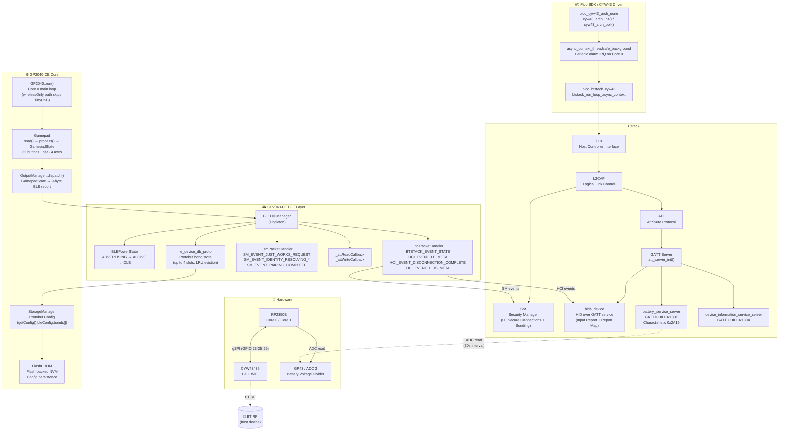
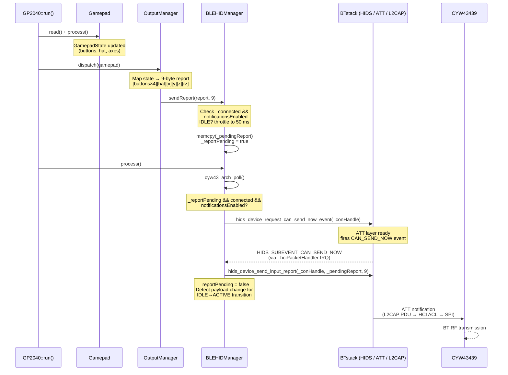
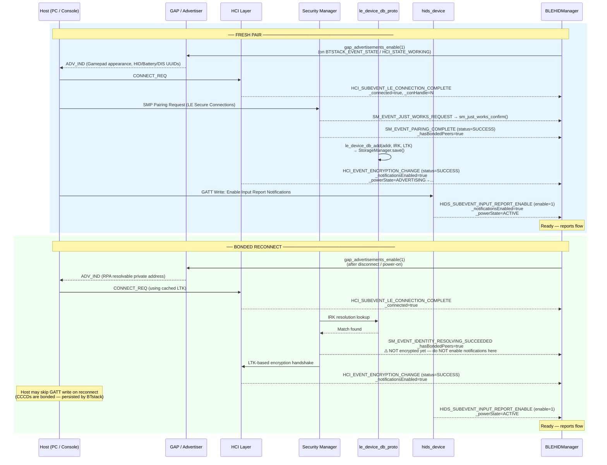

# GP2040-CE Bluetooth Architecture

GP2040-CE implements BLE HID gamepad output using the Raspberry Pi Pico SDK's BTstack integration layer on top of the CYW43439 wireless chip. When `INPUT_MODE_BLE` is selected at boot, TinyUSB is bypassed entirely and `BLEHIDManager` drives all radio and report delivery from the main Core 0 loop.

The diagrams below cover where each component lives (block diagram), how a gamepad report travels from button press to radio transmission (report-send sequence), and how pairing and bonded reconnect differ (connection lifecycle sequence).

---

## Block Diagram — Component Layers



> **Note:** `async_context_threadsafe_background` fires BTstack event processing from a periodic alarm IRQ on Core 0 — the same core as the main loop. All `BLEHIDManager` state variables shared between the IRQ context and the main thread are declared `volatile` to prevent compiler register-caching.

---

## Sequence Diagram — HID Report Send Flow



---

## Sequence Diagram — Connection Lifecycle (Fresh Pair vs Bonded Reconnect)



---

## Power State Reference

| State | Trigger (→ this state) | Behavior |
|---|---|---|
| **ADVERTISING** | Boot / Disconnect (`HCI_EVENT_DISCONNECTION_COMPLETE`) | `gap_advertisements_enable(1)`. No reports sent. Battery service inactive. TinyUSB skipped in wirelessOnly mode. |
| **ACTIVE** | `HIDS_SUBEVENT_INPUT_REPORT_ENABLE` (enable=1) **or** input change detected in `HIDS_SUBEVENT_CAN_SEND_NOW` while IDLE | Reports sent at gamepad frame rate. Battery ADC polled every 30 s via `battery_service_server_set_battery_value()`. |
| **IDLE** | No input change for 30 continuous seconds while ACTIVE | Reports throttled to ≤ 1 per 50 ms to reduce radio activity. Any payload change in `CAN_SEND_NOW` transitions back to ACTIVE. |

> **IDLE → ACTIVE detection:** The `_lastSentReport` buffer is compared against `_pendingReport` inside `HIDS_SUBEVENT_CAN_SEND_NOW` (IRQ context). If they differ, `_lastInputChangeMs` is refreshed and `_powerState` is set to `ACTIVE`. `_lastSentReport` is only written in the IRQ handler so it does not need `volatile`.

---

## GATT Profile Summary

Services declared in `src/ble_hid.gatt` (compiled to `ble_hid.h` at build time via `pico_btstack_make_gatt_header`):

| Service | UUID | Key Characteristics |
|---|---|---|
| GAP | 0x1800 | Device Name (`"GP2040-CE Gamepad"`), Appearance (Gamepad 0x03C4) |
| Battery Service | 0x180F | Battery Level (0x2A19) — GATT notify, read |
| Device Information | 0x180A | Manufacturer, Model, Firmware Revision |
| HID | 0x1812 | Report (Input, NOTIFY), Report Map, Protocol Mode, HID Info, Control Point |
| GATT | 0x1801 | Database Hash |

> The HID Input Report characteristic uses `REPORT_REFERENCE` descriptor `(1, 1)` to communicate Report ID 1. The ATT notification payload is 9 bytes with **no Report ID prefix** — the descriptor carries that association out-of-band.

---

## Bond Storage

`le_device_db_proto.cpp` implements the BTstack `le_device_db` interface backed by `Config.bleConfig.bonds[]` (protobuf, up to 4 slots). LRU eviction is handled via a per-slot `seqNr` counter. The protobuf backend replaces `le_device_db_tlv.c`, which mapped to the same flash region as FlashPROM and caused mutual corruption on every config save. The TLV source file is excluded at compile time via CMake `HEADER_FILE_ONLY`.

---

## Build System Integration

BLE support is gated on `PICO_CYW43_SUPPORTED` in `CMakeLists.txt`:

```cmake
if(PICO_CYW43_SUPPORTED)
    target_sources(... PRIVATE
        src/BLEHIDManager.cpp
        src/OutputManager.cpp
        src/le_device_db_proto.cpp
    )
    target_link_libraries(...
        pico_cyw43_arch_none
        pico_btstack_ble
        pico_btstack_cyw43
    )
    target_compile_definitions(... ENABLE_BLUETOOTH=1)
    pico_btstack_make_gatt_header(... src/ble_hid.gatt)
endif()
```

`ENABLE_BLUETOOTH=1` is the compile-time guard used in `gp2040.cpp`, `OutputManager.cpp`, and all BLE call sites to prevent BLE code from being compiled for boards without CYW43 (e.g. plain Pico, Pico 2).
